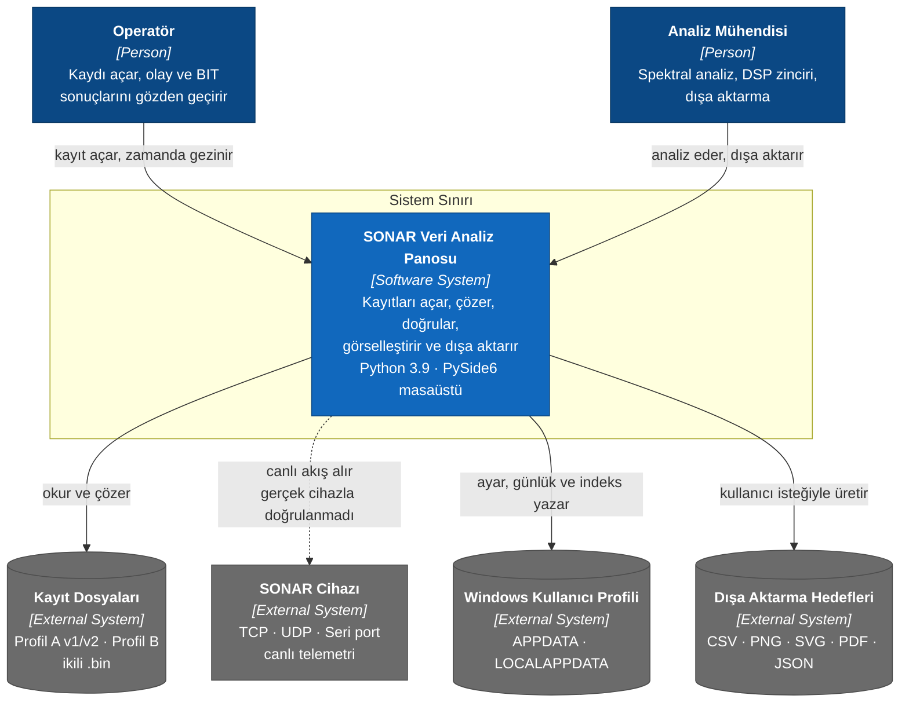
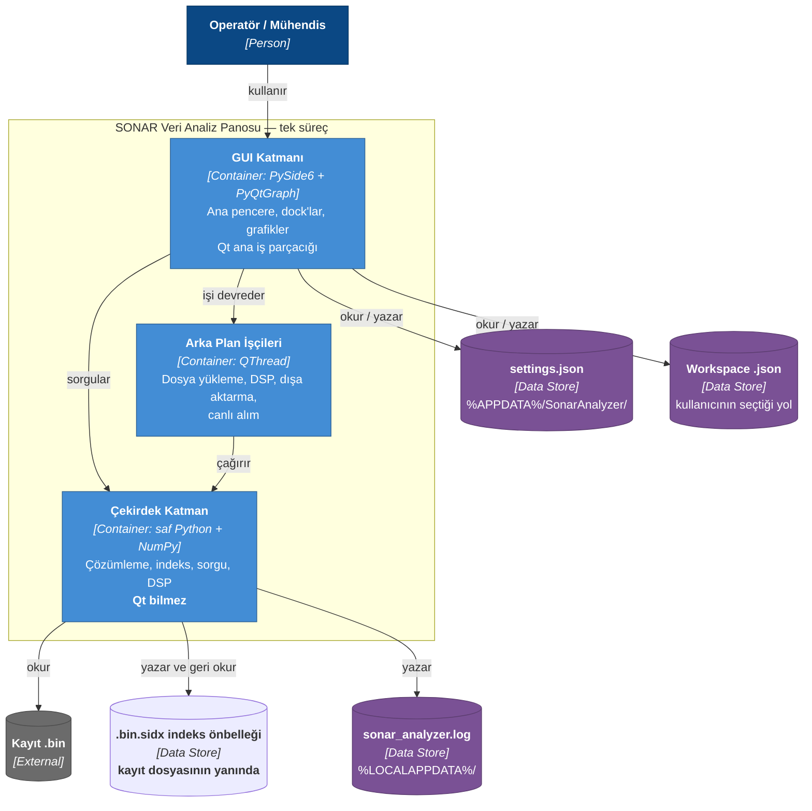
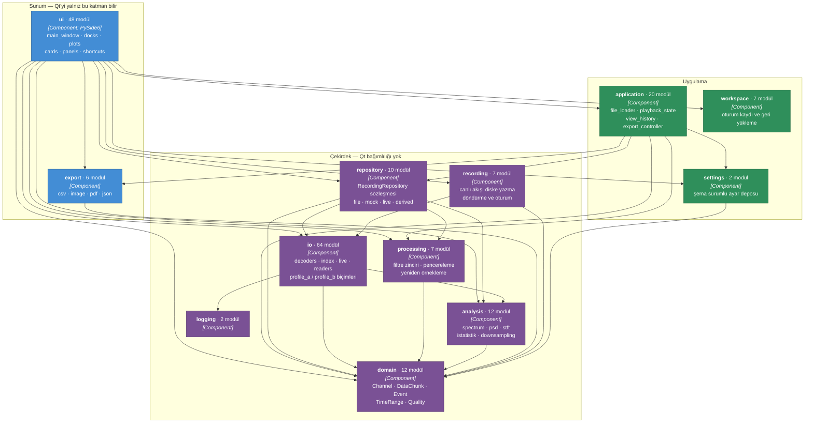
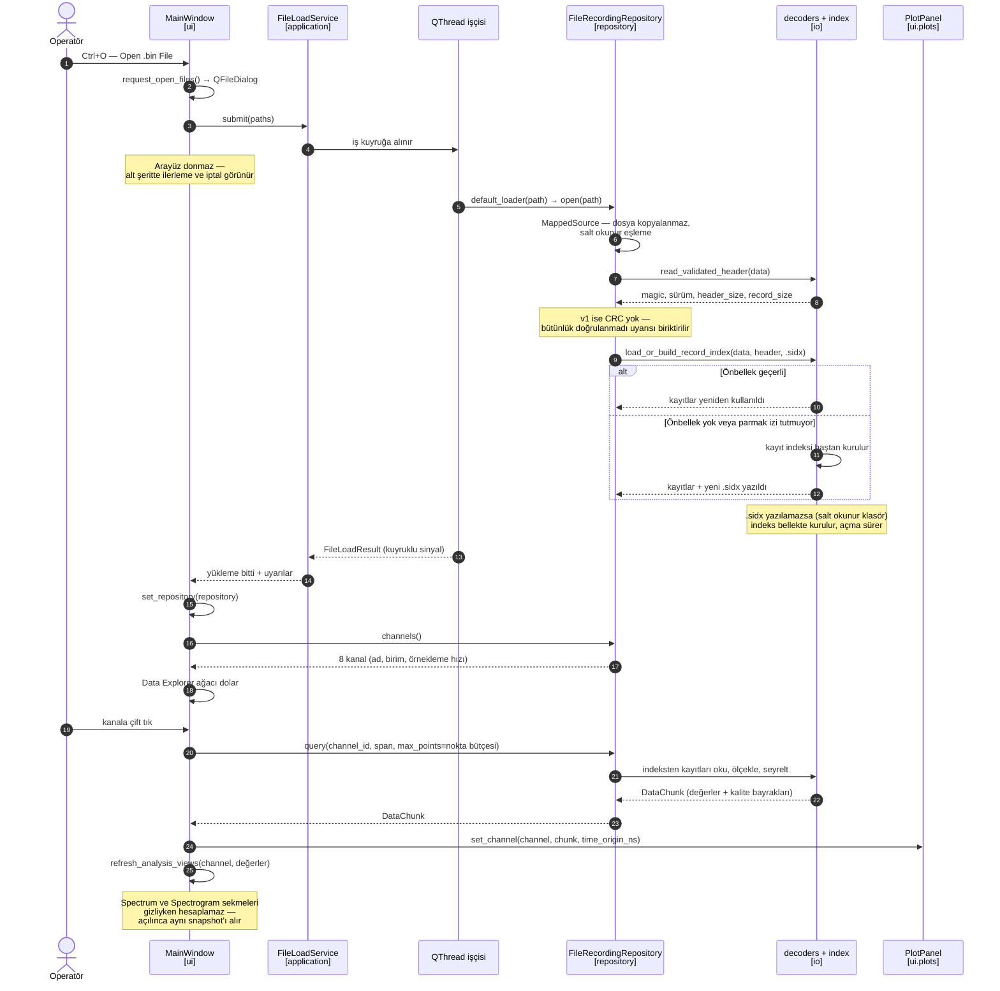

# C4 Mimari Modeli

Bu belge uygulamayı C4 modelinin dört seviyesinde anlatır: **Bağlam**, **Konteyner**,
**Bileşen** ve **Kod**. Diyagramlar Mermaid ile çizilmiştir.

> **Sözdizimi notu:** Mermaid'in yerleşik `C4Context` / `C4Container` sözdizimi hâlâ deneysel
> ve yerleşimi denetlenemiyor; kutular büyük modellerde üst üste biniyor. Bu yüzden
> diyagramlar `flowchart` ile çizildi, **C4 öğe adlandırması korunarak**
> (`[Person]`, `[Software System]`, `[Container]`, `[Component]`). Her yerde aynı
> şekilde çizilir.

Kaynak: `src/sonar_analyzer/` ağacı, sürüm **4.5.0**. Bağımlılık okları belgeden değil,
modüllerdeki gerçek `import` satırlarından çıkarıldı.

---

## Seviye 1 — Sistem Bağlamı

Kimin kullandığı ve sistemin dışarıda neye dokunduğu.



**Kesik ok neden kesik:** Canlı bağlantı katmanı yazıldı ve testleri var, ama elde gerçek
cihaz kaydı yok. Açık karar `E-01`/`E-02`; ayrıntı `docs/notes/open-decisions.md`.

---

## Seviye 2 — Konteynerler

Uygulama **tek işletim sistemi süreci**. Bu yüzden buradaki konteyner ayrımı
"ayrı çalışan servisler" değil, **süreç içindeki yürütme bağlamları ve kalıcı veri
depoları**dır.



### Kalıcı veri depoları

| Depo | Konum | Biçim | Amaç |
| --- | --- | --- | --- |
| Ayarlar | `%APPDATA%\SonarAnalyzer\settings.json` | JSON, şema sürümlü | Tema, son dosyalar, korelasyon toleransı |
| Günlük | `%LOCALAPPDATA%\...\sonar_analyzer.log` | metin | Tanılama |
| İndeks önbelleği | **kayıt dosyasının yanında**, `<ad>.bin.sidx` | JSON | Kayıt/olay/kanal indeksi; yeniden çözümlemeyi atlar |
| Workspace | kullanıcının seçtiği yol | JSON | Açık kanallar, düzen, görünüm durumu |

> İndeks önbelleğinin kurulum dizinine değil **kaydın yanına** yazılması bilinçli:
> salt okunur `Program Files` altına yazma denemesi olmaz. Karşılığında kayıt klasörü
> salt okunur bir paylaşımdaysa önbellek üretilemez.

---

## Seviye 3 — Bileşenler

Süreç içindeki Python alt paketleri. Oklar **gerçek `import` yönünü** gösterir.



### Katman kuralı nasıl korunuyor

Kural şu: **çekirdek katman (domain, io, repository, processing) Qt'yi bilmez.**
Bu belgeyle değil testle korunuyor. `tests/unit/test_layering.py`, her çekirdek paketi
**temiz bir alt süreçte** içe aktarır ve `sys.modules` içinde `PySide6`, `PyQt5/6`,
`shiboken6`, `pyqtgraph` veya `matplotlib` belirip belirmediğine bakar. Aynı süreçte
koşsaydı, daha önce Qt yüklemiş başka bir test sonucu yanıltırdı.

### Bildirilen sıralamayı delen bağımlılıklar

Paket docstring'i katmanları `domain → io → repository → processing → application → ui`
sırasıyla anlatıyor. Gerçek `import` grafiği bu sırayı **beş yerde** ters yönde deliyor.
Hiçbiri Qt kuralını bozmuyor, bu yüzden hiçbiri testle yakalanmıyor:

| Delik | Dosya | Ne içe aktarıyor |
| --- | --- | --- |
| `domain → io` | `domain/correlation.py` | `profile_a_format.RECORD_PERIOD_NS` |
| `domain → processing` | `domain/derived_channel_definition.py` | `ProcessingChain`, `ProcessingStep` |
| `io → analysis` | `io/decoders/profile_b_indexed_query.py`, `io/live/ring_buffer.py` | `downsample_chunk`, `streaming_envelope` |
| `io → repository` | `io/decoders/profile_b_indexed_query.py`, `io/live/file_replay_source.py` | `MemoryBoundedCache`, `RecordingRepository` |
| `repository → application` | `repository/derived_repository.py` | `derived_sample_rate` |

Ayrıca `application/layout_report.py`, `ui`'yi içe aktarıyor; bu **kasıtlı** ve dar
kapsamlı: bir içe aktarma `TYPE_CHECKING` altında, diğeri fonksiyon içinde. Modül
seviyesinde bağımlılık oluşturmuyor, yalnız `--layout-report` tanılama yolu çalışırken
gerçekleşiyor.

**Bu bir arıza raporu değil, bir ölçüm.** Beş deliğin hiçbiri çalışma zamanında hata
üretmiyor. Ama katman sırası yalnız docstring'de yazdığı için, sıralamayı koruyan bir
test olmadığı sürece yenileri sessizce eklenebilir.

---

## Seviye 4 — Kod: bir kayıt açılıp çizilene kadar

C4'ün dördüncü seviyesi her sınıfı çizmez, **bir yolu** açar. En çok kullanılan yol bu:
kullanıcı bir `.bin` açar ve bir kanalı grafikte görür.



### Bu yolda dikkat çeken üç karar

**Nokta bütçesi.** `query` çağrısı `max_points` alır ve bu değer grafiğin piksel
genişliğinden türer. Ekranda 1200 piksel varsa 10 milyon örneği çizmenin bir anlamı yok;
seyreltme okuma katmanında yapılır, çizim katmanında değil.

**İndeks önbelleği zorunlu değil.** `.sidx` yazılamıyorsa açma başarısız olmaz, yalnız
yavaşlar. Salt okunur bir paylaşımdaki kaydı incelemek engellenmemeli.

**Uyarılar sessizce yutulmaz.** Profil A v1'in CRC'si yoktur; dosya açılır ama
"bütünlük doğrulanmadı" uyarısı kullanıcıya taşınır. Kesik son kayıt da aynı şekilde:
tam kayıtlar kullanılır, kaç baytın atıldığı söylenir.

---

## Model ile kodun ayrıştığı yer

Diyagramlar kodu olduğu gibi gösteriyor. Bunun bir sonucu var ve yazılı olması gerekir:

**Profil B arayüzden açılamıyor.** `io/decoders/` altında tam bir Profil B çözücü var —
`profile_b.py`, `profile_b_timing.py`, `profile_b_validation.py`, `profile_b_sequence.py`,
`profile_b_indexed_query.py` ve `io/index/profile_b_index.py`. Hepsinin testi var ve
`tests/fixtures/acoustic_8records.bin` ile doğrulanıyor. Ama `application/file_loader.py`
yalnızca `FileRecordingRepository` üretiyor, o da yalnız Profil A okuyor. Profil B
çözücüsünü çağıran tek yer testler ve `tools/` altındaki karşılaştırma betikleri.

Doğrulaması tek komut:

```bash
grep -rn "profile_b" src/sonar_analyzer/repository src/sonar_analyzer/ui src/sonar_analyzer/application
# çıktı yok
```

Yani bir Profil B dosyası `Open .bin File` ile seçilirse `InvalidMagicError` alınır.
Eksik olan çözücü değil, **çözücüyü repository sözleşmesine bağlayan sınıf**.

## Kaynaklar

| Konu | Belge |
| --- | --- |
| Mimari karar kayıtları | `docs/adr/README.md` |
| Format sözleşmeleri | `docs/format/profile-a.md` · `docs/format/decoder-guide.md` |
| Arayüz yerleşimi | `docs/ui/layout-map.md` |
| Açık kararlar | `docs/notes/open-decisions.md` |
| Paketleme | `docs/adr/ADR-012-packaging.md` |
