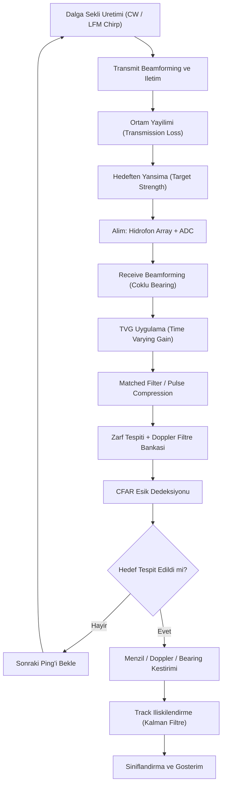
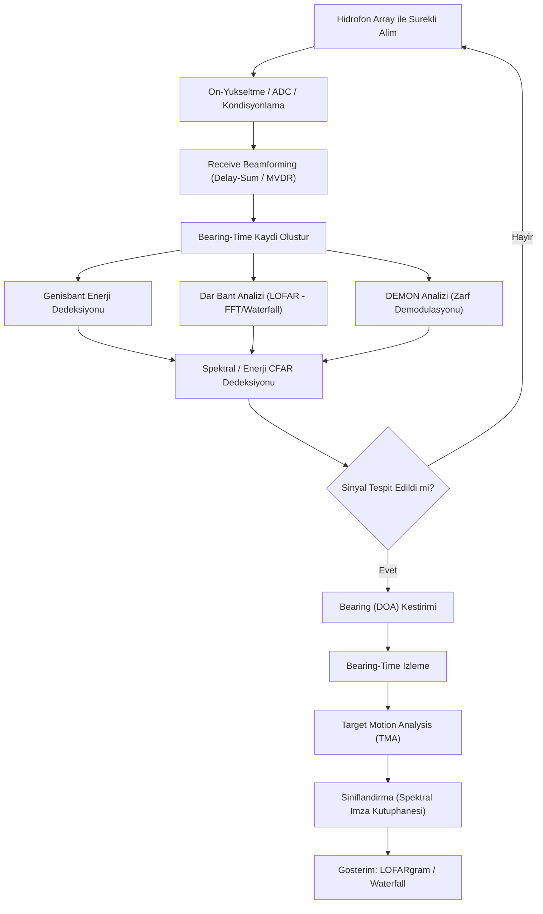
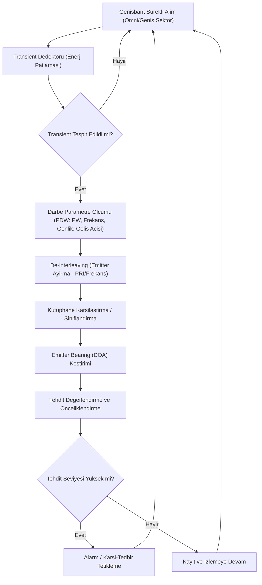

# SONAR: Temel Kavramlar ve Algoritma Bileşenleri

Bu doküman SONAR sinyal işlemede kullanılan temel DSP kavramlarını ve üç ana sonar modunun
(**Aktif**, **Pasif**, **İntercept**) temel algoritma bileşenlerini ve akış diyagramlarını içerir.

---

## 1. Temel Kavramlar

### 1.1 Bant Genişliği (Bandwidth, B)

Yayılan/işlenen sinyalin kapladığı frekans aralığıdır (Hz). Sonar için doğrudan **menzil
çözünürlüğünü** belirler:

```
ΔR = c / (2·B)
```

- `c`: sesin sudaki hızı (~1500 m/s)
- `B`: kullanılan bant genişliği

Geniş bant → yüksek menzil çözünürlüğü, ama daha fazla örnekleme hızı ve donanım karmaşıklığı
gerektirir. LFM chirp gibi geniş bantlı darbeler, pulse compression ile hem menzil çözünürlüğü
hem de işleme kazancı (processing gain) sağlar.

### 1.2 Örnekleme Frekansı (Sampling Rate, fs) ve Nyquist Kriteri

```
fs >= 2·B   (bandpass/undersampling durumunda)
fs >= 2·f_max  (baseband durumunda)
```

Kriter sağlanmazsa **aliasing** oluşur — yüksek frekans bileşenleri düşük frekans gibi görünür.
Sonarda tipik akustik bant birkaç Hz - birkaç yüz kHz arasında değişir (LF pasif arama ile HF
görüntüleme sonarı arasında büyük fark vardır), bu yüzden fs seçimi uygulamaya göre değişir.

### 1.3 SNR ve İşleme Kazancı (Processing Gain)

Matched filter / integrasyon sonrası kazanç, zaman-bant genişliği çarpımıyla orantılıdır:

```
Processing Gain (dB) ≈ 10·log10(B·T)
```

- `T`: darbe süresi (aktif) veya integrasyon süresi (pasif)

**Sonar denklemi** (basitleştirilmiş):

- Aktif: `SL − 2·TL + TS − (NL − DI) > DT`
- Pasif: `SL − TL − (NL − DI) > DT`

(SL: kaynak seviyesi, TL: transmisyon kaybı, TS: hedef güçlü, NL: gürültü seviyesi,
DI: array yönelim kazancı, DT: dedeksiyon eşiği)

### 1.4 Menzil ve Doppler Çözünürlüğü

- Menzil çözünürlüğü: `ΔR = c/(2B)` (yukarıda)
- Doppler (hız) çözünürlüğü: integrasyon/dwell süresi `T` ile ters orantılı: `Δf_d ≈ 1/T`
- Aktif sonarda genelde **belirsizlik ilişkisi (ambiguity)** vardır: iyi menzil çözünürlüğü için
  geniş bant, iyi Doppler çözünürlüğü için uzun darbe gerekir — bu ikisi CW/LFM tasarım
  seçimini belirler.

### 1.5 PRF / PRI (Pulse Repetition Frequency / Interval)

Aktif sonarda ardışık darbeler arası süre. Maksimum belirsiz menzili sınırlar:

```
R_max_unambiguous = c·PRI / 2
```

### 1.6 Matched Filter ve Pulse Compression

Alınan sinyal, gönderilen darbenin zaman-ters çevrilmiş kopyasıyla (replica) çapraz
korelasyona (cross-correlation) sokulur. Bu; SNR'yi maksimize eder ve LFM chirp gibi geniş
bantlı darbelerde **pulse compression ratio = B·T** kadar menzil çözünürlüğü kazancı sağlar.

### 1.7 Beamforming ve Array Kazancı

Hidrofon dizisinden gelen sinyaller, belirli bir yöne (bearing) odaklanacak şekilde
gecikme-toplama (delay-and-sum) veya adaptif yöntemlerle (MVDR/Capon) birleştirilir.

```
Array Gain (dB) ≈ 10·log10(N)   (N: eleman sayısı, ideal koşulda)
```

Directivity Index (DI), array'in yönelim kazancını (izotropik alıcıya göre) ifade eder.

### 1.8 TVG (Time Varying Gain)

Ses dalgası mesafe arttıkça yayılım kaybı (spreading loss) ve absorpsiyon nedeniyle zayıflar.
TVG, zamanla (=mesafeyle) artan bir kazanç uygulayarak uzak yankıların da yakın yankılar kadar
görünür olmasını sağlar. Aktif sonarda kritik bir ön-işleme adımıdır.

### 1.9 Ortam Gürültüsü ve Reverberasyon

- **Ambient noise**: gemi trafiği, deniz durumu, termal gürültü, biyolojik kaynaklar.
- **Reverberasyon**: aktif sonarda gönderilen darbenin deniz tabanı/yüzeyi/hacimden geri
  saçılması — kısa menzilde genelde reverberasyon, uzun menzilde ambient noise dedeksiyonu
  sınırlar.

---

## 2. SONAR Modları ve Temel Algoritma Bileşenleri

### 2.1 Aktif Sonar (Active Sonar)

Platform kendi darbesini (ping) gönderir, yankıyı dinler. Kendi konumunu belli eder ama net
menzil/hız bilgisi verir.

**Temel bileşenler:**
1. Dalga şekli üretimi (CW, LFM chirp, HFM)
2. Transmit beamforming ve iletim (transducer array)
3. Ortam yayılımı (transmission loss)
4. Alım (hidrofon array + ADC örnekleme)
5. Receive beamforming (çoklu bearing/beam)
6. TVG uygulaması
7. Matched filter / pulse compression
8. Zarf tespiti (envelope detection) + Doppler filtre bankası
9. CFAR eşik dedeksiyonu
10. Menzil–Doppler–Bearing kestirimi
11. Track ilişkilendirme (Kalman filtre tabanlı takip)
12. Sınıflandırma ve gösterim



### 2.2 Pasif Sonar (Passive Sonar)

Hiçbir şey yaymaz, sadece dinler. Gizliliği korur ama sadece bearing (yön) bilgisi verir;
menzil doğrudan ölçülemez (TMA gerekir).

**Temel bileşenler:**
1. Hidrofon array ile sürekli alım
2. Ön-yükseltme / ADC / kondisyonlama
3. Receive beamforming (konvansiyonel delay-sum veya adaptif MVDR) → bearing-time kaydı
4. Genişbant enerji dedeksiyonu (her beam için)
5. Dar bant analizi — **LOFAR** (Low Frequency Analysis and Recording): FFT + waterfall/spektrogram
6. **DEMON** analizi (zarf demodülasyonu — pervane şaft/kanat hızı imzası)
7. Spektral çizgi CFAR dedeksiyonu
8. Bearing (DOA) kestirimi ve bearing-time izleme
9. Target Motion Analysis (TMA) — sadece bearing ile üçgenleme/menzil kestirimi
10. Sınıflandırma (spektral imza kütüphanesi eşleştirme)
11. Gösterim (LOFARgram / waterfall)



### 2.3 Sonar İntercept (Akustik İntercept / Tehdit Uyarı)

Amaç, **kendi platformuna yönelik** başka bir aktif sonar ping'ini veya torpido arayıcı
(seeker) darbesini tespit edip erken uyarı vermektir. Radar dünyasındaki **ESM** (Electronic
Support Measures) kavramının akustik karşılığıdır — kendi yayın yapmaz, sadece transient
(geçici) darbeleri arar ve sınıflandırır.

**Temel bileşenler:**
1. Genişbant, çoğunlukla omnidirectional/geniş sektörlü sürekli alım
2. Transient (ani enerji patlaması) dedektörü — arka plan gürültüsünden darbeyi ayırma
3. Darbe parametre ölçümü (**PDW** çıkarımı: Pulse Width, Merkez Frekans, genlik, geliş açısı)
4. De-interleaving — üst üste binen birden fazla emitter'ın darbe trenlerini PRI/frekansa göre ayırma
5. Kütüphane karşılaştırma / sınıflandırma (bilinen tehdit sonar/torpido imzalarıyla eşleştirme)
6. Emitter bearing (DOA) kestirimi
7. Tehdit değerlendirme ve önceliklendirme (torpido vs. yüzey gemisi sonarı vs. dost kuvvet)
8. Alarm üretimi / karşı-tedbir tetikleme (decoy, manevra vb.)



---

## 3. Karşılaştırma Tablosu

| Özellik | Aktif Sonar | Pasif Sonar | İntercept (Akustik) |
|---|---|---|---|
| Yayın yapar mı? | Evet (ping gönderir) | Hayır | Hayır |
| Gizlilik | Düşük (kendini ele verir) | Yüksek | Yüksek |
| Doğrudan menzil bilgisi | Var (Δt üzerinden) | Yok (TMA gerekir) | Yok (amaç menzil değil, uyarı) |
| Doğrudan bearing bilgisi | Var | Var | Var |
| Ana işlem | Matched filter / pulse compression | Beamforming + LOFAR/DEMON | Transient dedeksiyon + PDW çıkarımı |
| Sınırlayıcı faktör | Reverberasyon (yakın) / gürültü (uzak) | Ortam gürültüsü, dizinin yönelim kazancı | Yanlış alarm oranı, de-interleaving karmaşıklığı |
| Tipik çıktı | Menzil-Doppler-Bearing | Bearing-time (LOFARgram) | PDW listesi + tehdit sınıfı/önceliği |
